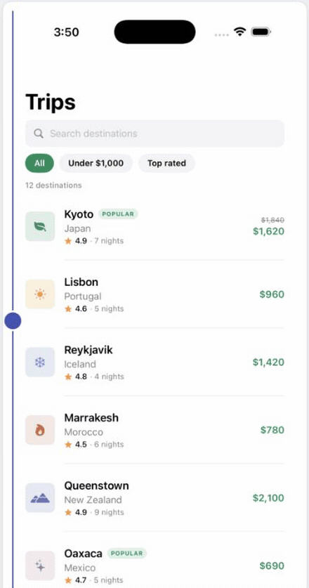
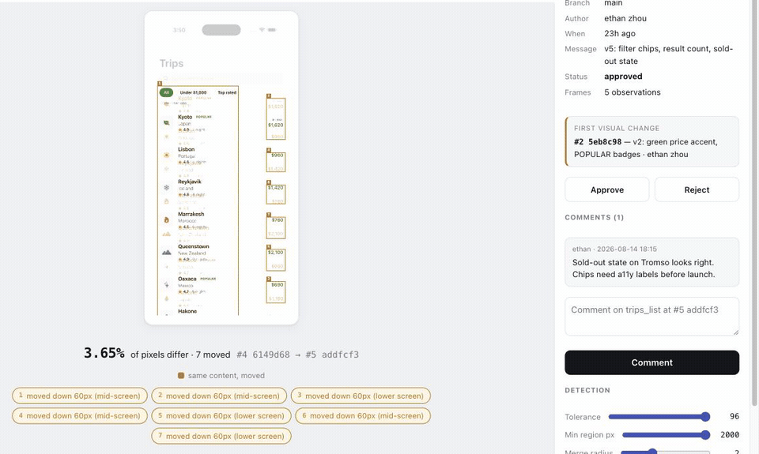

# atlas-review

A visual-review tool on top of [Revyl Atlas](https://revyl.ai).

`atlas-review report` writes **one self-contained HTML file** — the tool. Open
it, and every screen's build history is there: pick any two builds in either
direction, flip between four comparison modes, drag the detection thresholds,
approve or comment. No server, no build step, nothing to install for whoever
you send it to.



One screen, two builds, one divider. Left of it is `#4`, right of it is `#5` —
the search field becomes filter chips, the strikethrough prices resolve, and
the whole list shifts down. Both frames are in the file; the wipe is computed
in the page as you drag.

The Python package underneath is a normal SDK and CLI, for CI and scripting.

## Where the screens come from

```
every build you upload to Revyl
        ↓  a test run, or an exploration, walks the app
Atlas    one screenshot per screen, per build   ← this already exists
        ↓  atlas-review report
one .html file   the raw frames, inlined. no diffs baked in
        ↓  you open it
your browser     diffs any two frames on canvas, as you click
```

Line by line:

1. **Atlas is the input, not this tool.** Revyl maps your app as you test it and
   keeps a screenshot of every screen it has seen, tagged with the build. Five
   builds of one screen means five frames already sitting there.
2. **`atlas-review report` collects, it does not compute.** It pulls those
   frames (`revyl atlas graph --screenshots`) plus the git metadata attached to
   each build (`revyl build list`), and writes them into a single HTML file.
3. **The frames ship raw, byte for byte.** No diff is pre-rendered, and nothing
   is re-encoded — re-compressing a JPEG would change the very pixels the tool
   is about to measure.
4. **The diffing happens in your browser.** Pick two builds and the detector
   runs on canvas: per-pixel tolerance, an 8px block grid to kill JPEG speckle,
   then connected components into boxes.
5. **That is the whole trick.** Nothing was decided ahead of time, so every
   build pair works in either direction and the thresholds are draggable:

   

   Shipping n frames instead of n² × 4 rendered diffs also makes the file
   smaller — the Voyage report went from 1.7 MB to 447 KB when the diffing
   moved into the browser.
6. **Your review goes back out.** Approvals and comments land in `review.json`
   next to the code (or stay in the browser if you were sent a static file).

The catch is that the detector now exists twice: `diff.py` for CI, and
`assets/report.js` for the page. Tests pin the constants they share
(`JsPythonParity`), so a gate reading 1.00% and a report showing 0.98% can't
happen quietly.

## What it adds

Atlas stops at "here are some pictures". `atlas-review` turns that into a
review workflow:

| What it adds | Command |
| --- | --- |
| Side-by-side, overlay and highlighted visual diffs | `atlas-review diff <screen> --mode overlay` |
| Commit, PR, author and timestamp on every build | `atlas-review builds` |
| The first build where something changed | `atlas-review blame <screen> [--region ...]` |
| Comments and approvals on the changed screen | `atlas-review serve` / `approve` / `comment` |
| Alerts on unexpected visual change | `atlas-review check` |
| Build names a human can tell apart | everywhere: `#4 6149d68` instead of `34fc6d70-dc0f-…` |
| Every screen that changed in a build | `atlas-review changes` |

## Apps with many screens

One screen is a diff; a real app is a triage problem. The report opens on an
**overview**: every screen measured between the same two builds, ranked by how
much it moved, so the first thing you see is *what this build actually looks
different in*.

- Cards show a change thumbnail, the percentage, region counts and review
  status. Click one to drill in; <kbd>Esc</kbd> returns.
- The build pair is app-wide, so drilling into a screen keeps the comparison
  you were already looking at, and the picker offers every build (flagging the
  ones a given screen never appeared in).
- The rail filters and sorts by most-changed, and screens that exist in only
  one of the two builds are called out as *new* or *not in this build* rather
  than counted as unchanged.
- Frames are deduplicated by content hash, so a screen that did not change
  ships its bytes once instead of once per build.

From the terminal:

```bash
atlas-review changes                 # every screen that changed in the latest build
atlas-review changes --build "#3" --markdown   # PR table
atlas-review report --builds 12      # cap a long history
atlas-review report --screen home_dashboard --screen checkout
```

**Mixed capture resolutions.** Atlas returns whatever the run produced — the
same screen can arrive at 440px from one device and 1320px (3x) from another.
Comparing those by padding to a common canvas reports ~95% changed, which is
noise dressed as a finding, so every frame of a screen is normalised to one
width before measuring. A genuine *aspect* change (rotation, a different device
shape) still surfaces as `frame size changed`.

**Builds with no Atlas data** are reported as such, never as "nothing changed".
A build nothing was observed on cannot be clean; `check` raises a warning and
`changes` says so explicitly.

## Install

```bash
pipx install /path/to/atlas-review     # or: pip install -e .
```

Requires Python 3.9+, Pillow, numpy, and an authenticated `revyl` CLI on PATH
(or `REVYL_BIN` pointing at it).

## Quick start

```bash
atlas-review init --app <revyl-app-id>   # writes .atlas-review.json
atlas-review report --open               # the tool: one HTML file
atlas-review builds                      # who shipped what, when
atlas-review history trips_list          # per-build change history for one screen
atlas-review diff trips_list --mode overlay -o diff.png
atlas-review blame trips_list            # which build changed it first
atlas-review serve                       # same UI, approvals write to disk
```

In the report: **click** a build to set *after*, **shift-click** to set
*before*, <kbd>←</kbd>/<kbd>→</kbd> to step, <kbd>1</kbd>–<kbd>4</kbd> for
modes, <kbd>s</kbd> to swap. **Export PNG** drops the current comparison out for
a PR comment.

## The six features

### 1. Visual diffs

Three renderings of the same comparison:

- `highlight` — the new frame, washed out except where it changed, boxed and
  numbered. The default; best for "what moved?"
- `overlay` — onion-skin. Content only in the old build is red, only in the new
  build is blue, so a shifted row shows as a red ghost above a blue one.
- `side-by-side` — labelled before/after cards with change boxes on both.
- `swipe` — drag a divider across the two frames (report only).
- `mask` — raw change mask, for tuning thresholds (CLI only).

Detection is not a raw pixel compare. Atlas frames are JPEGs off a live device,
so they carry compression speckle, and the status-bar clock differs on every
capture. Without handling both, every frame reads as 100% changed. So:

1. per-pixel tolerance (`--tolerance`, default 32),
2. an 8px block grid with a density floor, which kills isolated speckle,
3. connected components over changed blocks → a handful of bounding boxes,
4. ignore regions, with a `status_bar` mask on by default.

Regions that are the same content translated vertically are labelled `moved`
(amber) rather than `changed` (red). Inserting one row pushes every row below it
down; without this the report says "the entire list changed" and reviewers stop
reading it.

### 2. Build provenance

`revyl build list` carries a `metadata.git` block. Every build exposes:

```python
build.commit_short   # 6149d68
build.author         # ethan zhou
build.branch         # main
build.subject        # "v4: search field, tinted tiles"
build.relative_time  # 19h ago
build.commit_url     # https://github.com/owner/repo/commit/...
build.pr_url         # filled in with --prs (asks `gh` which PR held the commit)
```

Set `repo` in the config (or `--repo owner/name`) when the build was not
produced in the checkout you are running from.

### 3. First-changed-build detection

```bash
atlas-review blame trips_list
# trips_list first changed in #2 · main · 5eb8c98 · "v2: green price accent" · 21h ago
#   — by ethan zhou — 0.79% of pixels, 11 changed regions — last unchanged build: #1 fb23564
```

Scope it to a region to ask a sharper question — `--region x,y,w,h` as fractions
of the frame:

```bash
atlas-review blame trips_list --region 0.04,0.175,0.90,0.045 --threshold 0.05
# ... first changed in #4 · main · 6149d68 · "v4: search field, tinted tiles"
```

`--threshold` is a fraction of the *region's own area*, so `0.05` reads as "more
than 5% of that band changed". Two strategies:

- `--method scan` (default) walks adjacent builds oldest-first. Exact.
- `--method bisect` binary-searches against a baseline: ~log₂(n) frames instead
  of n, which matters on an app with hundreds of builds. It assumes the change
  persists once introduced and verifies its answer against the immediately
  preceding build, reporting `verified: false` if that assumption breaks.

### 4. Comments and approvals

```bash
atlas-review approve trips_list --build "#5" -m "filter chips are intentional (PROD-412)"
atlas-review approve trips_list --build "#4" --reject -m "was-price contrast too low"
atlas-review comment trips_list --build "#4" -m "bump grey to #6b7280" --region 0.78,0.28,0.22,0.08
atlas-review serve      # same thing, in the browser, on the screenshot itself
```

State lives in `.atlas-review/review.json`, which is meant to be committed: the
sign-off travels with the branch that changed the screen, and "what did this
screen last look like when someone approved it" is answerable offline.

A static `atlas-review report` keeps decisions in localStorage and exports
`review.json`; `atlas-review import review.json` merges it back.

### 5. Alerts

`atlas-review check` compares each screen against **the last approved build**
(not merely the previous one, so an unreviewed change keeps alerting instead of
silently becoming the new normal) and applies `.atlas-review.json`:

```json
{
  "app": "4cf9100b-2d6d-4771-bbc2-213278f0864e",
  "policy": {
    "compare_against": "approved",
    "default": { "max_change_pct": 2.0, "require_approval": false },
    "screens": {
      "trips_list": {
        "max_change_pct": 1.0,
        "require_approval": true,
        "watch": [
          { "name": "price column", "box": [0.78, 0.15, 0.22, 0.8], "severity": "error" }
        ]
      }
    },
    "diff": { "ignore": ["status_bar"], "tolerance": 32 }
  }
}
```

Rules: watched/frozen regions, an overall change budget, "changed without a
sign-off", and frame-geometry drift. Approving a build downgrades its alerts to
informational — otherwise CI stays red forever after an intentional redesign.
Set `"ignore_approval": true` on a watch region that must alert regardless.

```bash
atlas-review check --markdown            # PR comment
atlas-review check --json                # machine readable
atlas-review check --webhook https://... # Slack-style POST
atlas-review check --fail-on warning     # CI gate; exits non-zero
```

### 6. Clearer build names

`34fc6d70-dc0f-4ef3-9154-3553ccdfbcd1` and `main-20260813-152514` are both
unreadable in a filmstrip. Every build gets:

- `label` — `#4 6149d68`
- `title` — `#4 · main · 6149d68 · "v4: search field, tinted tiles" · 19h ago`

and is addressable as `#4`, a uuid prefix, a commit sha, a version string, or
`latest`.

## SDK

```python
from atlas_review import AtlasReview

rv = AtlasReview("4cf9100b-2d6d-4771-bbc2-213278f0864e", repo="owner/voyage")

for build in rv.builds():
    print(build.title, build.commit_url)

diff = rv.diff("trips_list", "#3", "#4")
print(diff.summary)                    # 7.49% of pixels, 4 moved
diff.render("overlay").save("d.png")
print(diff.changed_fraction_in((0.78, 0.15, 0.22, 0.8)))

print(rv.blame("trips_list").summary)
print(rv.blame("trips_list", region=(0.04, 0.175, 0.9, 0.045), threshold=0.05).build.label)

rv.approve("trips_list", "#5", note="intentional")
report = rv.check()
print(report.to_markdown(), report.exit_code())

rv.report("out/")                       # single self-contained HTML file
```

Two axes, two methods: `rv.changes(build)` is every screen that changed in one
build; `rv.screen_changes(screen)` is one screen across every build.

`AtlasReview.history(screen)` returns a `ScreenHistory` for lower-level work:
`.versions()`, `.changes()`, `.timeline()`, `.first_change()`, `.bisect()`.

## CI

```yaml
- run: revyl build upload --app $APP --path app.zip     # produces the build
- run: revyl workflow run smoke --build-id $BUILD_ID    # feeds Atlas
- run: atlas-review check --markdown --fail-on error >> $GITHUB_STEP_SUMMARY
```

A build only has Atlas data once it has been observed, so run your tests against
it first. Screens are cached under `.atlas-review/cache` keyed by build id;
`--refresh` re-pulls.

## Caveats

- Diff quality is bounded by Atlas exploration coverage: a screen that no test
  or session reached in a build simply is not in that build's graph.
- Screen matching is VLM-semantic. A big enough redesign forks a screen into a
  new node, and the version history restarts there. See
  `revyl atlas graph --build <id>`.
- `--region` blame answers "when did these *pixels* change", not "when did this
  widget appear". In a list that reflows, a fixed band changes whenever content
  above it grows.

## Let an agent set it up

The repo ships as a skill, so Claude Code or Codex can wire it up against your
app without you reading any of the above:

```bash
git clone https://github.com/RevylAI/screenhistory
claude   # then: "use the screenhistory skill on my app"
```

`SKILL.md` at the root is the Claude Code / plugin entry point (`.claude-plugin/`
holds the manifests); `codex-skill/` is the Codex twin. The skill checks the
`revyl` CLI is authenticated, confirms your builds are actually mapped in Atlas,
scaffolds `.atlas-review.json`, and builds the report.

## Tests

```bash
python3 -m unittest discover -s tests
```

65 tests, no network and no `revyl` CLI needed — images and payloads are
synthetic. `JsPythonParity` pins the constants the Python detector and the
browser detector must share; extend it whenever the algorithm changes.

## Built by Revyl

This shows you what changed on your screens. [Revyl](https://revyl.com?utm_source=screenhistory&utm_medium=readme&utm_campaign=footer) tells you whether it still works.

It is the mobile reliability platform this is built on: Atlas is Revyl's map of your app, one screenshot per screen per build, and that map is what makes a build-over-build history possible at all. Write tests in plain English, run them on cloud devices, and every run feeds more screens back into the map. screenhistory itself is MIT licensed and stays that way.

[Start free](https://app.revyl.ai/signup?utm_source=screenhistory&utm_medium=readme&utm_campaign=footer) · [Docs](https://docs.revyl.com) · [revyl.com](https://revyl.com?utm_source=screenhistory&utm_medium=readme&utm_campaign=footer)

As a little easter egg for reading this far, here is one month of Revyl free: [`ng32jDS9`](https://app.revyl.ai/signup?promo=ng32jDS9&utm_source=screenhistory&utm_medium=readme&utm_campaign=easter-egg) :)
